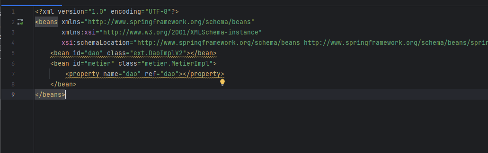

<h3>Compte Rendu </h3>
<h4>Interface IDao</h4>
Cette interface définit un contrat pour les classes d'accès aux données (DAO - Data Access Object). Elle contient une méthode getData() qui, lorsqu'elle est implémentée, doit retourner une valeur de type double. Les classes qui implémentent cette interface fourniront une manière d'accéder aux données (par exemple, en récupérant des données d'une base de données).

<h4>Classe DaoImpl</h4>
Cette classe est une implémentation concrète de l'interface IDao. Elle doit fournir le code pour la méthode getData(). Dans votre exemple, la méthode getData() imprime simplement une chaîne de caractères pour indiquer qu'elle serait normalement utilisée pour accéder à une base de données, et retourne une valeur statique de type double.

<h4>Interface Metier</h4>
Cette interface définit un contrat pour les classes de logique métier. Elle contient une méthode calcul() qui, lorsqu'elle est implémentée, doit retourner une valeur de type double. Les classes qui implémentent cette interface sont responsables de fournir des calculs métier, qui peuvent s'appuyer sur les données récupérées via IDao.

<h4>Classe MetierImpl</h4>
Cette classe est une implémentation de l'interface IMetier et contient la logique métier. Elle a une dépendance vers IDao, qui est nécessaire pour obtenir les données sur lesquelles elle va effectuer des calculs. L'injection de dépendance est réalisée par un mécanisme de setter.

<h4>Injection de dépendance par instanciation dynamique </h4>
L'injection de dépendance par instanciation dynamique se produit lorsque vous créez une instance de votre classe de logique métier (MetierImpl) sans lui fournir directement ses dépendances via le constructeur. Au lieu de cela, vous utilisez une méthode setter (setDao) pour injecter la dépendance après la création de l'objet. Ceci est souvent utilisé pour changer la dépendance à l'exécution si nécessaire.

<h4>Injection de dépendance par instanciation statique </h4>
Dans l'injection de dépendance par instanciation statique, l'objet dépendant (MetierImpl) est directement instancié avec sa dépendance (DaoImpl) via son constructeur.
Dans ce cas, MetierImpl est créé avec une instance de DaoImpl déjà en place, ce qui signifie que MetierImpl est prêt à l'emploi dès sa création. L'injection de dépendance par le constructeur est souvent privilégiée pour les dépendances obligatoires, car elle garantit que l'objet ne peut pas être créé sans ses dépendances nécessaires. Cela améliore la sûreté à l'exécution car cela prévient les erreurs liées à l'oubli de l'initialisation des dépendances.
<h4>Injection de dépendance en utilisant le Framework Spring :
-	Version XML :
</h4>
Le fichier config.xml est un document de configuration XML utilisé par le framework Spring pour définir et configurer les beans, qui sont des objets gérés par le conteneur Spring IoC (Inversion of Control). Dans ce fichier, deux beans sont déclarés : dao, qui est une instance de ext.DaoImplV2, et metier, qui est une instance de metier.MetierImpl. Le bean metier est configuré pour injecter le bean dao via une propriété appelée dao, établissant ainsi une dépendance entre les deux. Cette configuration sépare la création d'objets et leur assemblage de l'implémentation du code, favorisant ainsi une conception flexible et modulaire.

La classe PresentationSpringXml dans le package presentation est utilisée pour démontrer l'injection de dépendances à l'aide de Spring avec une configuration basée sur XML. Elle utilise ApplicationContext, un type de conteneur IoC, pour charger la configuration des beans à partir de config.xml. En appelant context.getBean("metier"), elle récupère une instance de MetierImpl avec sa dépendance IDao déjà injectée, comme défini dans le fichier de configuration. La méthode calcul() est ensuite invoquée sur cette instance, démontrant que l'injection de dépendances et la récupération des beans via Spring sont correctement configurées et fonctionnelles.

L'approche utilisée est celle de la configuration déclarative de Spring avec XML, une méthode traditionnelle pour gérer l'injection de dépendances dans des applications Java. En définissant les beans et leurs relations dans un fichier XML externe, on sépare la configuration de l'assemblage de l'application de son code source, ce qui permet une plus grande flexibilité et facilite les modifications sans nécessiter de recompiler le code. Lors de l'exécution, Spring lit ce fichier de configuration, crée les instances des beans définis, et gère leurs dépendances automatiquement. Cela permet d'obtenir des instances d'objets prêtes à l'emploi avec toutes leurs dépendances nécessaires résolues, favorisant ainsi une conception d'application faiblement couplée et facile à tester.
<h4>-  Version annotations : </h4>
Le fichier config.xml est un document de configuration XML utilisé par le framework Spring pour définir et configurer les beans, qui sont des objets gérés par le conteneur Spring IoC (Inversion of Control). Dans ce fichier, deux beans sont déclarés : dao, qui est une instance de ext.DaoImplV2, et metier, qui est une instance de metier.MetierImpl. Le bean metier est configuré pour injecter le bean dao via une propriété appelée dao, établissant ainsi une dépendance entre les deux. Cette configuration sépare la création d'objets et leur assemblage de l'implémentation du code, favorisant ainsi une conception flexible et modulaire.
La classe PresentationSpringXml dans le package presentation est utilisée pour démontrer l'injection de dépendances à l'aide de Spring avec une configuration basée sur XML. Elle utilise ApplicationContext, un type de conteneur IoC, pour charger la configuration des beans à partir de config.xml. En appelant context.getBean("metier"), elle récupère une instance de MetierImpl avec sa dépendance IDao déjà injectée, comme défini dans le fichier de configuration. La méthode calcul() est ensuite invoquée sur cette instance, démontrant que l'injection de dépendances et la récupération des beans via Spring sont correctement configurées et fonctionnelles.

